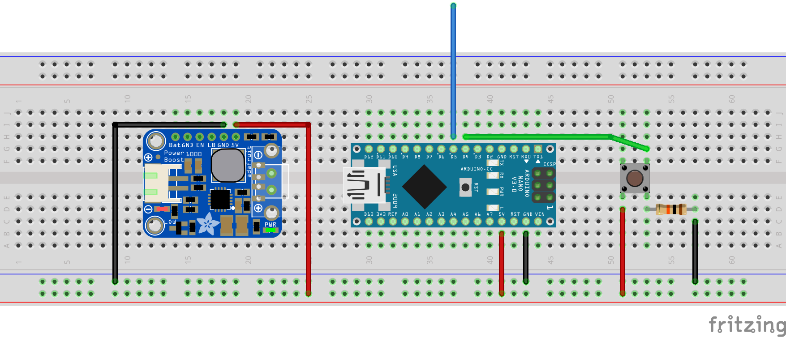

# Thermal Katana

This repo contains the code used for Thermal Katana [Kit](https://www.etsy.com/uk/listing/889195924/arasaka-thermal-katana-kit-cyberpunk) and [3d files](https://www.etsy.com/uk/listing/900160685/arasaka-thermal-katana-3d-files).

The code was written for Arduino Nano. It assumes you have connected the LED to digital port 5 and the on/off switch to digital port 4 (see the schematic for details).

The blue wire is the data pin for the LEDs.

For this code to work, you need to install [FastLED](https://github.com/FastLED/FastLED) library.